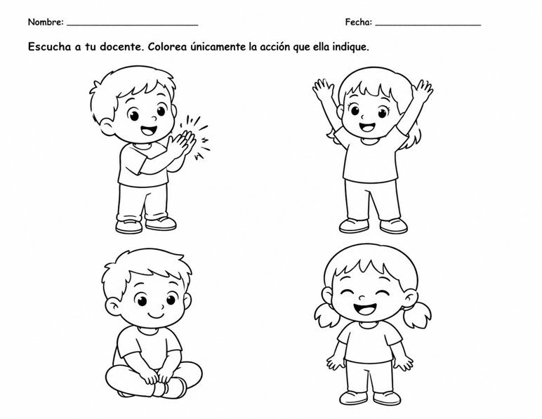
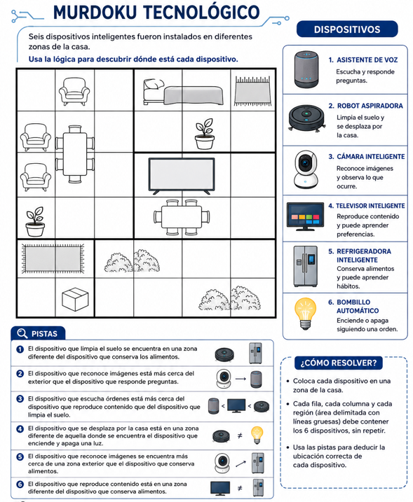

<html lang="es">
<head>
    <meta charset="UTF-8">
    <meta name="viewport" content="width=device-width, initial-scale=1.0">
    <title>Guía Semanal de Trabajo</title>
    
</head>
<body>

    <h1>GUÍA SEMANAL DE TRABAJO</h1>

    <!-- LUNES -->
    <h2 class="day-title">Lunes 12 de octubre</h2>

    

        <h3>Grupo Transición 2</h3>
        
Horario: 8:00 a.m. a 8:40 a.m.

        
Docente que acompaña: Niña Ruth

        
        <h4>¿Qué debe hacer la docente?</h4>
        <ol>
            <li>Recoger al grupo en su aula a las 8:00 a.m. y trasladarlo al laboratorio.</li>
	     <li>La persona docente demuestra diferentes formas de conectar piezas utilizando el Kit de Snap Circuits, explicandole que deben llevar orden y que cada uno coloca una pieza.</li>
            <li>Guiar y supervisar la actividad de construcción utilizando el Kit de Snap Circuits.</li>
            <li>Acompañar al grupo durante toda la lección.</li>
            <li>Despachar/trasladar a los niños a su aula 5 minutos antes de finalizar la lección (a las 8:35 a.m.).</li>
        </ol>

        <h4>Actividad de los estudiantes:</h4>
        
Utilizando el Kit de Snap Circuits, construir estructuras mediante la selección, organización y unión de diferentes piezas, explorando formas de conexión y organización, realizando la página 12, proyecto 1 y 2. La hoja de trabajo queda en el escritorio, favor recogerlas ya que se utilzará con el otro grupo.

 Hacer grupos de 4 estudiantes

        <h4>Recursos:</h4>
        <ul>
            <li>Kit de Snap Circuits</li>
            <li>Guía/Libro de Snap Circuits (Página 12, proyectos 1 y 2)</li>
        </ul>

        

            <h4>Indicaciones especiales:</h4>
            <ul>
                <li>Recoger obligatoriamente al grupo en su aula a las 8:00 a.m.</li>
                <li>Despachar a los chicos a las 8:35 a.m. (5 minutos antes) ya que el grupo 4-2 ingresa a las 8:40 a.m.</li>
                <li>La docente (Ruth) acompañante ayuda con la disciplina y con las salidas al baño.</li>
                <li><strong>Este grupo no utiliza computadora.</strong></li>
            </ul>
        

    

    

        <h3>Grupo 4-2</h3>
        
Horario: Entran a las 8:40 a.m.

        
        <h4>¿Qué debe hacer la docente?</h4>
        <ol>
            <li>El grupo llega al laboratorio a las  8:40 a.m. </li>
            <li>Dictar o explicar los siguientes conceptos básicos del sistema operativo: Escritorio, Barra de tareas, Íconos y Menú Inicio.</li>
            <li>Explicar a los estudiantes el funcionamiento de la aplicación en línea Sketchpad (<a href="https://sketch.io/sketchpad/es/index.html" target="_blank">https://sketch.io/sketchpad/es/index.html</a>).</li>
            <li>Guiar a los estudiantes en la creación y guardado de sus trabajos digitales .Exportar> Downloads> One Drive> Busca su grupo > Busca su carpeta > Guardar con el nombre Mi escritorio</li>
        </ol>

        <h4>Actividad de los estudiantes:</h4>
        <ul>
            <li><strong>Escribir los conceptos:</strong>
                <ul>
                    <li><em>Escritorio:</em> Pantalla principal con íconos y barra de tareas.</li>
                    <li><em>Barra de tareas:</em> Barra inferior para acceder a programas.</li>
                    <li><em>Iconos:</em> Pequeños dibujos que representan programas o archivos.</li>
                    <li><em>Menú Inicio:</em> Menú para buscar y abrir opciones de la computadora.</li>
                </ul>
            </li>
            <li>Utilizando la aplicación Sketchpad, realizar un dibujo de las partes vistas en clase. Escritorio, iconos, barra de tareas , menú inicio</li>
            <li>Guardar sus trabajos al finalizar.</li>
        </ul>

        <h4>Recursos:</h4>
        <ul>
            <li>Computadoras</li>
            <li>Plataforma Web Sketchpad: <a href="https://sketch.io/sketchpad/es/index.html" target="_blank">https://sketch.io/sketchpad/es/index.html</a></li>
        </ul>

        

            <h4>Indicaciones especiales:</h4>
            <ul>
               
                <li>Supervisar que las computadoras queden debidamente apagadas al concluir la lección.</li>
            </ul>
        

    

    

        <h3>Grupo Transición 1</h3>
        
Horario: 10:10 a.m. a 10:50 a.m.

        
Docente que acompaña: Niña Verónica

        
        <h4>¿Qué debe hacer la docente?</h4>
        <ol>
            <li>Recoger al grupo en su aula a las 10:10 a.m. y trasladarlo al laboratorio.</li>
            <li>Guiar y supervisar la actividad práctica con el Kit de Snap Circuits. Es la misma actividad del grupo de transición anterior</li>
            <li>Acompañar al grupo durante la lección y coordinar la atención a las necesidades de los niños.</li>
        </ol>

        <h4>Actividad de los estudiantes:</h4>
        
Construir estructuras mediante la selección, organización y unión de diferentes piezas con el Kit de Snap Circuits, explorando formas de conexión y organización (página 12, proyecto 1 y 2).

        <h4>Recursos:</h4>
        <ul>
            <li>Kit de Snap Circuits</li>
            <li>Guía de Snap Circuits (Página 12, proyectos 1 y 2)</li>
        </ul>

        

            <h4>Indicaciones especiales:</h4>
            <ul>
                <li>Recoger al grupo en su aula a las 10:10 a.m.</li>
                <li>La docente Verónica se lleva al grupo al finalizar, acompaña y colabora con el manejo de conducta y traslados al baño.</li>
                <li><strong>Este grupo no utiliza computadora.</strong></li>
 <li><strong>Trabajar esta actividad en grupos de 4.</strong></li>
            </ul>
        

    

    

        <h3>Grupo 2-2</h3>
        
Horario: Interrumpido (Inicio antes de almuerzo 10:50 am y retoman a las 12:00 p.m.)

        
        <h4>¿Qué debe hacer la docente?</h4>
        <ol>
            <li>Recoger al grupo en su aula para el inicio de la clase.</li>
            <li>Mostrar ejemplos de dibujos en Tux Paint y conversar sobre sus posibilidades.</li>
            <li>Orientar la planificación oral haciendo preguntas guía sobre el tema libre que elegirán, formas, herramientas y colores.</li>
            <li>Faltando 10 minutos para las 11:30 a.m., llevar a los estudiantes al aula para que calienten y almuercen.</li>
            <li>Cuidar el pasillo de arriba durante el tiempo de almuerzo.</li>
            <li>A las 12:00 p.m., recoger nuevamente a los niños en su aula y traerlos al laboratorio.</li>
            <li>Acompañar el desarrollo del dibujo pidiendo que usen: Pincel, Formas, Líneas, Rellenar, Texto, Sellos y Colores.</li>

            <li>Guiar la revisión y cierre, invitando a exposiciones voluntarias de sus dibujos.</li>
        </ol>

        <h4>Actividad de los estudiantes:</h4>
        
Planificación oral y creación de un dibujo digital en Tux Paint que represente un tema elegido libremente, integrando varias herramientas, colores, formas y detalles. Presentación voluntaria al grupo.

        <h4>Recursos:</h4>
        <ul>
            <li>Computadoras</li>
            <li>Programa Tux Paint</li>
        </ul>

        

            <h4>Indicaciones especiales:</h4>
            <ul>
                <li>Recoger al grupo en su aula.</li>
                <li><strong>Llevar al aula 10 minutos antes de las 11:30 a.m. para el almuerzo.</strong></li>
                <li><strong>Cuidar el pasillo de arriba en el almuerzo.</strong></li>
                <li><strong>A las 12:00 p.m. ir por ellos al aula y traerlos de nuevo al laboratorio.</strong></li>
<li><strong>Indicar que guarden el dibujo, ellos ya saben donde</strong></li>
                <li>Verificar que las computadoras estén apagadas (los chicos de segundo por lo general las apagan solos).</li>
            </ul>
        

    

    <!-- MARTES -->
    <h2 class="day-title">Martes 13 de octubre</h2>

    

        <h3>Grupo 3-2</h3>
        
        <h4>¿Qué debe hacer la docente?</h4>
        <ol>
            <li>Recoger al grupo en su aula y trasladarlo al laboratorio.</li>
            <li>Guiar el repaso de los conceptos previamente escritos por los estudiantes.</li>
            <li>Proyectar el video indicado (activar subtítulos).</li>
            <li>Guiar a los estudiantes para ingresar a la plataforma CODE.ORG y realizar la Lección 3.</li>
        </ol>

        <h4>Actividad de los estudiantes:</h4>
        <ul>
            <li>Repasar conceptos: Error (bug), Depuración (Debugging), Bucle (Loop), Programa (Program) y Programación (Programming).</li>
            <li>Observar el video.</li>
            <li>Ingresar a CODE.ORG y hacer la lección 3.</li>
        </ul>

        <h4>Recursos:</h4>
        <ul>
            <li>Computadoras con Internet</li>
            <li>Video de YouTube: <a href="https://www.youtube.com/watch?v=Y_paSrH2ffw" target="_blank">https://www.youtube.com/watch?v=vgkahOzFH2Q</a></li>
            <li>Plataforma CODE.ORG, ellos tienen en sus cuadernos de Mensajes , Luciana Chavés lo pego en el de español los datos para ingresar</li>
        </ul>

        

            <h4>Indicaciones especiales:</h4>
            <ul>
                <li>Recoger al grupo en su aula.</li>
                <li>Revisar el apagado de las computadoras.</li>
            </ul>
        

    

    

        <h3>Grupo 1-2</h3>
        
        <h4>¿Qué debe hacer la docente?</h4>
        <ol>
            <li>Recoger al grupo en su aula y traerlo al laboratorio.</li>
            <li>Retomar las partes del mouse y realizar un breve ejercicio de reconocimiento atravez del siguiente video Video de YouTube: <a href="https://youtu.be/973TJIkR7Dc?si=Bnq4vZ8KTpACzvIw&t=176" target="_blank">https://youtu.be/973TJIkR7Dc?si=Bnq4vZ8KTpACzvIw&t=176</a></li>
            <li>Explicar que el movimiento del mouse permite llevar el puntero hacia diferentes lugares, arriba, abajo, derecha e izquierda.</li>
            <li>Guiar el ingreso a GCompris para la actividad de motricidad.</li>
        </ol>

        <h4>Actividad de los estudiantes:</h4>
        
Ingresar a GCompris y desarrollar «Mueve el ratón o toca la pantalla», moviendo el mouse sobre los bloques para hacerlos desaparecer y descubrir la imagen. Cuando terminan la actividad dejarlos jugar en Gcompris lo que quieran

        <h4>Recursos:</h4>
        <ul>
            <li>Computadoras</li>
            <li>Programa GCompris</li>
        </ul>

        

            <h4>Indicaciones especiales:</h4>
            <ul>
                <li>Recoger al grupo en su aula.</li>
                
            </ul>
        

    

    

        <h3>Grupo 6-2</h3>
        
        <h4>¿Qué debe hacer la docente?</h4>
        <ol>
            <li>Recoger al grupo en su aula y trasladarlo al laboratorio. Ellos se sientan en el piso y observan la explicación en la pantalla</li>
            <li>Explicar cómo aplicar formatos en Excel: tamaño, fuente, color, negrita, cursiva, subrayado y bordes.</li>
            <li>Indicar que abran el archivo de trabajo y dar instrucciones de guardado (ellos saben como guardar sus trabajos).</li>
        </ol>

        <h4>Actividad de los estudiantes:</h4>
        
Abrir el archivo "Trabajo Formato de textos", aplicar los formatos indicados y guardar el archivo en sus carpetas con el nombre especificado. El cual se encuentra en sus carpetas personales

Si terminan el trabajo continuar con el archivo <strong>mapeo de zonas</strong> que se encuentra en sus carpetas y por último si se portan bien y trabajan tienen tiempo libre, nada más vigilar que no usen cosas indebidas.

        <h4>Recursos:</h4>
        <ul>
            <li>Computadoras</li>
            <li>Microsoft Excel (Archivo: Trabajo Formato de textos)</li>
        </ul>

        

            <h4>Indicaciones especiales:</h4>
            <ul>
                <li>Recoger al grupo en su aula.</li>
                <li>Revisar que las computadoras queden apagadas.</li>
            </ul>
        

    

    <!-- MIÉRCOLES -->
    <h2 class="day-title">Miércoles 14 de octubre</h2>

    

        <h3>Grupo 3-1</h3>
        
        <h4>¿Qué debe hacer la docente?</h4>
        <ol>
            <li>Recoger al grupo en su aula y trasladarlo al laboratorio.</li>
<li>Indicar que trabajarán con la ficha que la docente le dio, recordar que se hace en parejas el trabajo y que deben dibujar la parte 1 y el compañero debe decifrar el algoritmo.</li>
 <li>Repartir las hojas de los estudiantes que les hace falta Emma Beteta y Ryan Lazcares</li>
            <li>Indicar que estarán trabajando en la plataforma code.org y que para iniciar deben acceder con los datos que tienen en el cuaderno de mensajes</li>
            <li>Entregar las tarjetas pendientes que estan en el escritorio.</li>
            <li>Guiar el ingreso a Code.org para la resolución del ejercicio.</li>
        </ol>

        <h4>Actividad de los estudiantes:</h4>
        <ul>
          
           
            <li>Entrar a Code.org y hacer el ejercicio Lección 2.</li>
        </ul>

        <h4>Recursos:</h4>
        <ul>
            <li>Computadoras con Internet</li>
            <li>Plataforma Code.org</li>
 <li>Ficha de trabajo impresa (Ficha 1 - Simón dice) Se encuentra en el escritorio</li>

        </ul>

        

            <h4>Indicaciones especiales:</h4>
            <ul>
                <li>Recoger al grupo en su aula.</li>
                <li>Verificar que las computadoras queden debidamente apagadas.</li>
            </ul>
        

    

    

        <h3>Grupo Materno 1</h3>
        
Docente que acompaña: Ana

        
        <h4>¿Qué debe hacer la docente?</h4>
        <ol>
            <li>Recibir a los estudiantes formando un círculo.</li>
            <li>Explicar las reglas del juego "Simón dice" de manera sencilla y hacer una demostración.</li>
            <li>Iniciar el juego con acciones lentas de un solo paso (ej. aplaudir, tocar la cabeza, saltar).</li>
            <li>Incorporar trampas (instrucciones sin decir "Simón dice"). No eliminar niños si se equivocan.</li>
            <li>Realizar conversación guiada sobre la importancia de escuchar con atención.</li>
            <li>Entregar y explicar la ficha de trabajo impresa.</li>
        </ol>

        <h4>Actividad de los estudiantes:</h4>
        
Participar activamente en el juego, seguir instrucciones, expresar la importancia de escuchar y completar la ficha de cierre (coloreando únicamente la acción que indique la docente).

        <h4>Recursos:</h4>
        <ul>
            <li>Ficha de trabajo impresa (Ficha 1 - Simón dice) Se encuentra en el escritorio</li>

            <li>Lápices de colores</li>
        </ul>

        

            <h4>Indicaciones especiales:</h4>
            <ul>
                <li>Recoger al grupo en su aula.</li>
                <li>La docente Ana los acompaña.</li>
                <li><strong>Este grupo no utiliza computadora.</strong></li>
            </ul>
        

    

    

        <h3>Grupo 5-1</h3>
        
        <h4>¿Qué debe hacer la docente?</h4>
        <ol>
            <li>Presentar la "Caza del Tesoro de la IA" mostrando un mapa para encontrar la IA escondida.</li>
            <li>Analizar ejemplos comunes y fomentar el debate sobre si la IA ahorra tiempo.</li>
            <li>Introducir el concepto de "Buscador Inteligente".</li>
            <li>Demostrar cómo Google predice y autocompleta frases basado en búsquedas previas.</li>
            <li>Explicar cómo las páginas detectan intereses para mostrar publicidad.</li>
        </ol>

        <h4>Actividad de los estudiantes:</h4>
        
Analizar el Murdoku Tecnológico. Abrir un navegador web, ingresar palabras incompletas, observar las sugerencias automáticas, anotar tres predicciones correctas y dialogar en grupo.

        <h4>Recursos:</h4>
        <ul>
            <li>Computadoras con navegador Web</li>
            <li>Mapa / Ficha Murdoku Tecnológico</li>

        </ul>

        

            <h4>Indicaciones especiales:</h4>
            <ul>
                <li>Recoger al grupo en su aula.</li>
                <li>Revisar el apagado correcto de los equipos.</li>
            </ul>
        

    

    

        <h3>Grupo 6-1</h3>
        
        <h4>¿Qué debe hacer la docente?</h4>
        <ol>
            <li>Explicar cómo aplicar en Excel formatos de tamaño, fuente, color, negrita, cursiva, subrayado y bordes.</li>
            <li>Indicar que abran el archivo asignado y aplicar las pautas de guardado.</li>
        </ol>

        <h4>Actividad de los estudiantes:</h4>
        
Abrir el archivo "Trabajo Formato de textos", aplicar los formatos indicados y guardarlo en sus carpetas.

        <h4>Recursos:</h4>
        <ul>
            <li>Computadoras</li>
            <li>Microsoft Excel (Archivo: Trabajo Formato de textos)</li>
        </ul>

        

            <h4>Indicaciones especiales:</h4>
            <ul>
                <li>Recoger al grupo en su aula.</li>
                <li>Supervisar que las computadoras queden apagadas correctamente.</li>
            </ul>
        

    

    <!-- JUEVES -->
    <h2 class="day-title">Jueves 15 de octubre</h2>

    

        <h3>Grupo 4-1</h3>
        
Horario: Entran a las 8:40 a.m.

        
        <h4>¿Qué debe hacer la docente?</h4>
        <ol>
            <li>Recoger al grupo en su aula.</li>
            <li>Dictar/explicar los conceptos: Escritorio, Barra de tareas, Íconos y Menú Inicio. 
Escritorio:
Es la pantalla principal que vemos cuando encendemos la computadora. Allí encontramos los íconos, la barra de tareas y otros elementos que nos ayudan a utilizar la computadora.

Barra de tareas:
Es la barra que generalmente se encuentra en la parte inferior de la pantalla. Nos permite acceder rápidamente a programas, aplicaciones y funciones de la computadora.

Iconos:
Son pequeños dibujos o imágenes que representan programas, archivos, carpetas o funciones de la computadora. Al hacer clic sobre ellos podemos abrirlos o utilizarlos.

Menú Inicio:
Es el menú que aparece al hacer clic en el botón Inicio. Desde allí podemos buscar y abrir programas, acceder a archivos y utilizar diferentes opciones de la computadora.</li>
            <li>Explicar el uso de la herramienta web Sketchpad.</li>
            <li>Guiar la elaboración y guardado del dibujo digital.</li>
        </ol>

        <h4>Actividad de los estudiantes:</h4>
        
Escribir los conceptos y utilizar Sketchpad para realizar un dibujo de las partes de la computadora vistas en clase, guardando el archivo al final.

        <h4>Recursos:</h4>
        <ul>
            <li>Computadoras</li>
            <li>Aplicación Web Sketchpad: <a href="https://sketch.io/sketchpad/es/index.html" target="_blank">https://sketch.io/sketchpad/es/index.html</a></li>
        </ul>

        

            <h4>Indicaciones especiales:</h4>
            <ul>
                <li>Recoger al grupo en su aula a las 8:40 a.m.</li>
                <li><strong>Cuidar el recreo de las 8:40 a.m. y el de las 10:00 am  frente a las mesitas de dirección.</strong></li>
                <li>Revisar el apagado correcto de los equipos.</li>
            </ul>
        

    

    

        <h3>Grupo Materno 2</h3>
        
Docente que acompaña: Rocío

        
        <h4>¿Qué debe hacer la docente?</h4>
        <ol>
            <li>Recibir a los estudiantes (vienen de física) formando un círculo.</li>
            <li>Explicar las reglas y realizar el juego "Simón dice" fomentando la escucha activa.</li>
            <li>Guiar una conversación posterior sobre la importancia de seguir instrucciones.</li>
            <li>Entregar y explicar la ficha de trabajo impresa.</li>
        </ol>

        <h4>Actividad de los estudiantes:</h4>
        
Jugar a "Simón dice", seguir indicaciones simples y completar la ficha de cierre coloreando únicamente la acción que indique la docente.

        <h4>Recursos:</h4>
        <ul>
            <li>Ficha de trabajo impresa (Ficha 1 - Simón dice)</li>

            <li>Lápices de color</li>
        </ul>

        

            <h4>Indicaciones especiales:</h4>
            <ul>
                <li>Recoger al grupo (vienen de Educación Física).</li>
                <li>La docente Rocío los acompaña.</li>
                <li><strong>Este grupo no utiliza computadora.</strong></li>
            </ul>
        

    

    

        <h3>Grupo 2-1</h3>
        
        <h4>¿Qué debe hacer la docente?</h4>
        <ol>
            <li>Mostrar ejemplos de dibujos en Tux Paint y orientar la planificación oral con los estudiantes. Antes de comenzar a utilizar la computadora, cada estudiante realiza una pequeña planificación oral. La docente puede orientar la conversación mediante preguntas como:
¿Qué tema vas a dibujar?
¿Qué elementos tendrá tu dibujo?
¿Qué colores utilizarás?
¿Qué figuras geométricas puedes incorporar?
¿Qué detalles agregarás para decorar tu dibujo?
</li>
            <li>Acompañar el proceso de creación en la computadora solicitando el uso de diferentes herramientas (Pincel, Formas, Sellos, etc.).</li>
            <li>Guiar el cierre con la presentación voluntaria de los dibujos.</li>
            <li>Acompañar a los estudiantes a su aula faltando 5 minutos para terminar.</li>
        </ol>

        <h4>Actividad de los estudiantes:</h4>
        
Planificar y elaborar un dibujo digital libre en Tux Paint integrando diversas herramientas. Encender y apagar sus propias computadoras.

        <h4>Recursos:</h4>
        <ul>
            <li>Computadoras</li>
            <li>Programa Tux Paint</li>
        </ul>

        

            <h4>Indicaciones especiales:</h4>
            <ul>
                <li>Recoger al grupo en su aula.</li>
                <li><strong>Acompañar a los estudiantes a su aula faltando 5 minutos.</strong></li>
                <li>Los estudiantes encienden y apagan las computadoras; revisar nada más que estén bien apagadas.</li>
            </ul>
        

    

    <!-- VIERNES -->
    <h2 class="day-title">Viernes 16 de octubre</h2>

    

        <h3>Grupo 1-1</h3>
        
        <h4>¿Qué debe hacer la docente?</h4>
        <ol>
            <
            <li>Recoger al grupo en su aula y traerlo al laboratorio.</li>
            <li>Retomar las partes del mouse y realizar un breve ejercicio de reconocimiento atravez del siguiente video Video de YouTube: <a href="https://youtu.be/973TJIkR7Dc?si=Bnq4vZ8KTpACzvIw&t=176" target="_blank">https://youtu.be/973TJIkR7Dc?si=Bnq4vZ8KTpACzvIw&t=176</a></li>
            <li>Explicar que el movimiento del mouse permite llevar el puntero hacia diferentes lugares, arriba, abajo, derecha e izquierda.</li>
            <li>Guiar el ingreso a GCompris para la actividad de motricidad.</li>

        </ol>

        <h4>Actividad de los estudiantes:</h4>
        
Ingresar a GCompris y desarrollar «Mueve el ratón o toca la pantalla», fortaleciendo el control de movimiento y la coordinación.

        <h4>Recursos:</h4>
        <ul>
            <li>Computadoras</li>
            <li>Programa GCompris</li>
        </ul>

        

            <h4>Indicaciones especiales:</h4>
            <ul>
                <li>Recoger al grupo en su aula.</li>
                <li>Revisar que las computadoras queden debidamente apagadas.</li>
            </ul>
        

    

    

        <h3>Grupo 5-2</h3>
        
        <h4>¿Qué debe hacer la docente?</h4>
        <ol>
            <li>Presentar la "Caza del Tesoro de la IA" y fomentar el debate sobre automatización.</li>
            <li>Introducir el concepto de Buscador Inteligente.</li>
            <li>Demostrar el autocompletado en Google y explicar cómo funciona la publicidad dirigida.</li>
        </ol>

        <h4>Actividad de los estudiantes:</h4>
        
Resolver la lógica del Murdoku Tecnológico. Usar el navegador para probar el autocompletado de Google, anotar ejemplos y debatir en grupo.

        <h4>Recursos:</h4>
        <ul>
            <li>Computadoras con navegador web</li>
            <li>Ficha/Mapa Murdoku Tecnológico</li>

        </ul>

        

            <h4>Indicaciones especiales:</h4>
            <ul>
                <li>Recoger al grupo en su aula.</li>
                <li>Apagar las computadoras correctamente y revisar que queden debidamente apagadas (últimos grupos de la semana).</li>
            </ul>
        

    

    <!-- RECORDATORIOS -->
    

        <h2>RECORDATORIOS GENERALES DE LA SEMANA</h2>
        <ul>
            <li><strong>Traslado de estudiantes:</strong> Todos los grupos deben recogerse en el aula correspondiente para llevarlos al laboratorio. Estar atenta a los horarios específicos de regreso anticipado o traslados.</li>
            <li><strong>Revisión de computadoras:</strong> Revisar exhaustivamente que las computadoras queden debidamente apagadas al finalizar cada clase, especialmente los últimos grupos del viernes.</li>
            <li><strong>Cuidado en recreos y almuerzo:</strong>
                <ul>
                    <li>Lunes: Cuidar el pasillo de arriba en el almuerzo (11:30 a.m. aprox).</li>
                    <li>Jueves: Cuidar el recreo de las 8:40 a.m. y el siguiente frente a mesitas de dirección.</li>
                </ul>
            </li>
            <li><strong>Materiales requeridos:</strong> Fichas de Simón Dice, Murdoku Tecnológico, Kits Snap Circuits y archivos/enlaces preparados previamente en las computadoras.</li>
            <li><strong>Grupos sin computadoras:</strong> Materno y Transición <strong>no</strong> usan computadora. Las maestras acompañantes (Ruth, Verónica, Ana, Rocío) ayudan con los chicos que necesitan ir al baño y con el comportamiento general.</li>
        </ul>
    

</body>
</html>
